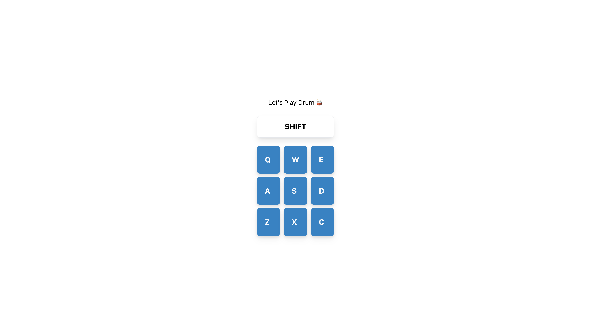

# 🎵 Drum Machine

The **Drum Machine** is an interactive web app built with **React** that allows you to play drum sounds by clicking on drum pads or using your keyboard. It dynamically displays the name of the sound being played, offering a fun and engaging experience for music enthusiasts or developers learning React.

---

## 🚀 Features
- **Interactive Drum Pads**: Click on the pads or press the corresponding keys (`Q`, `W`, `E`, etc.) to play sounds.
- **Keyboard Support**: Trigger drum sounds using your keyboard keys for a seamless experience.
- **Dynamic Sound Display**: Displays the name of the active sound in real-time.
- **Responsive Design**: Works flawlessly on all screen sizes, from desktop to mobile.
- **Smooth Animations**: Pads visually respond when clicked or pressed.

---

## 🛠️ Technologies Used
- **React**: Built with functional components and hooks for dynamic interactivity.
- **Tailwind CSS**: For responsive and modern styling.
- **Vite**: Development environment for fast builds.
- **Audio Clips**: Sourced from [FreeCodeCamp Drum Machine](https://www.freecodecamp.org/).

---

## 🎹 How to Use
1. Clone the repository:
   ```bash
   git clone https://github.com/yourusername/drum-machine.git
   cd drum-machine

2. Install dependencies:
   ```bash
   npm install

3. Start the development server:
   ```bash
   npm run dev

4. Open the app in your browser at `http://localhost:5173`

5. Click on the drum pads or press the corresponding keys (Q, W, E, etc.) to start playing!

## 🌐 Live Demo

Check out the live demo here: [Drum Machine](https://drum-machine-javed-ak.vercel.app)

---

## 📸 Screenshot



---

## 🧑‍💻 Author

**Javed Akhtar**  
- [Portfolio](https://javedakhtar.vercel.app/)  
- [Twitter](https://twitter.com/javed__ak)  
- [GitHub](https://github.com/javed-ak)

---

## 🤝 Contributing

Feel free to contribute to this project by forking the repository and submitting a pull request. All contributions are welcome!
